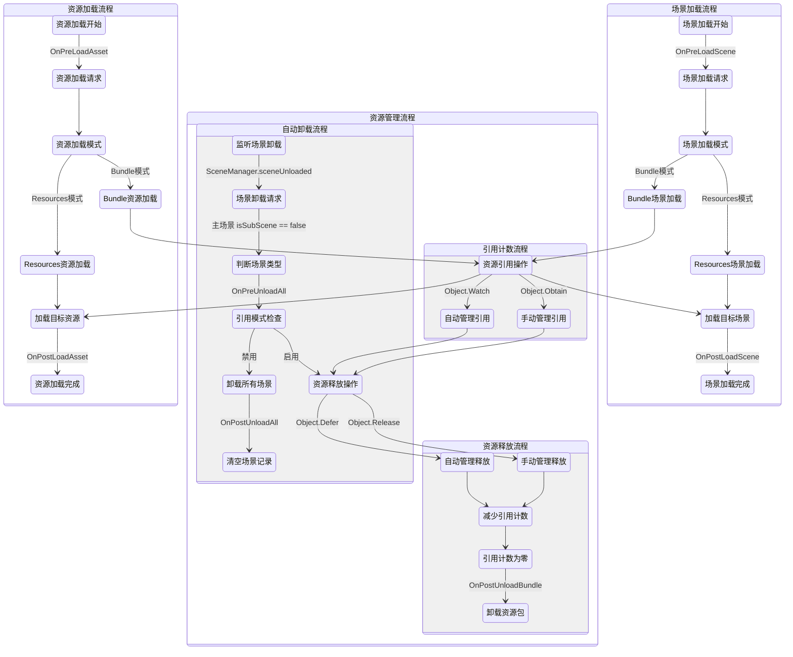

# XAsset.Core

[](https://www.npmjs.com/package/org.eframework.u3d.res)
[](https://www.npmjs.com/package/org.eframework.u3d.res)
[](https://deepwiki.com/eframework-org/U3D.RES)

XAsset.Core 实现了资源管理器的自动初始化，提供了系统事件管理、异步加载处理器等功能。

## 功能特性

- 自动初始化：自动加载资源清单并全局管理资源
- 系统事件：定义资源系统生命周期中的关键事件
- 引用计数：通过引用计数机制管理资源生命周期

## 使用手册

### 1. 运行流程

以下流程图展示了资源管理器的运行时逻辑，包括资源/场景加载/卸载、引用计数管理、内置事件机制的主要流程：



### 2. 事件类型

- 功能说明：定义资源生命周期中的关键事件
- 事件列表：
  - `OnPreLoadAsset`：资源加载前
  - `OnPostLoadAsset`：资源加载后
  - `OnPreLoadScene`：场景加载前
  - `OnPostLoadScene`：场景加载后
  - `OnPreUnloadAll`：卸载所有资源前
  - `OnPostUnloadAll`：卸载所有资源后
  - `OnPostUnloadBundle`：资源包卸载后
- 使用示例：
```csharp
XAsset.Event.Reg(XAsset.EventType.OnPreLoadAsset, (asset) => Debug.Log("资源加载前：" + asset));
```

## 常见问题

更多问题，请查阅[问题反馈](../CONTRIBUTING.md#问题反馈)。

## 项目信息

- [更新记录](../CHANGELOG.md)
- [贡献指南](../CONTRIBUTING.md)
- [许可证](../LICENSE.md)
