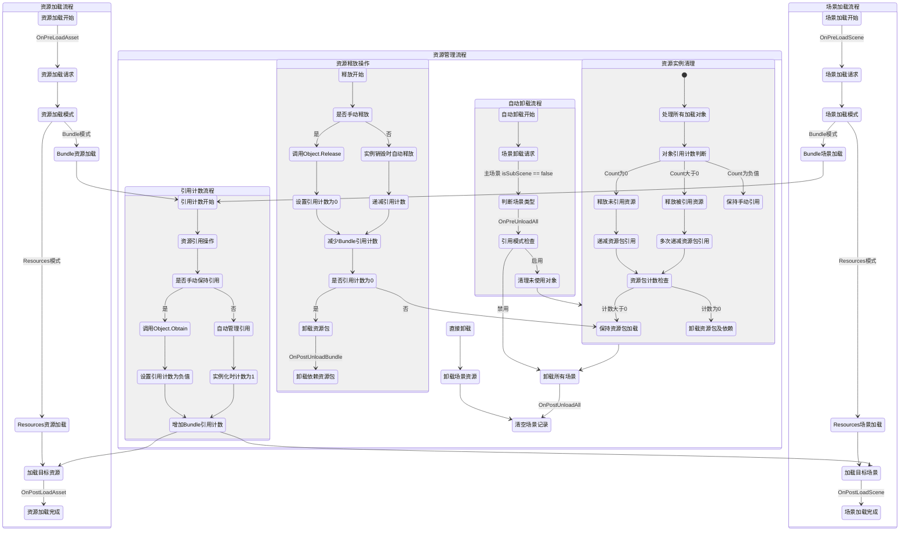

# XAsset.Core

[](https://www.npmjs.com/package/org.eframework.u3d.res)
[](https://www.npmjs.com/package/org.eframework.u3d.res)
[](https://deepwiki.com/eframework-org/U3D.RES)

XAsset.Core 实现了资源管理器的自动初始化，提供了系统事件管理、异步加载处理器等功能。

## 功能特性

- 自动初始化：自动加载资源清单并全局管理资源
- 系统事件：定义资源系统生命周期中的关键事件
- 引用计数：通过引用计数机制管理资源生命周期

## 使用手册

### 1. 运行流程

以下流程图展示了资源管理器的运行时逻辑，包括初始化、资源加载、引用计数管理、事件触发和资源卸载的主要流程：



#### 关键流程说明：

1. 系统初始化
   - 在编辑器模式和运行时，通过 `[InitializeOnLoadMethod]` 和 `[RuntimeInitializeOnLoadMethod]` 自动初始化
   - 加载资源清单文件，为后续资源加载做准备
   - 注册场景加载和卸载的回调函数，为资源生命周期管理奠定基础

2. 资源加载流程
   - 资源加载开始时触发 OnPreLoadAsset 事件，允许外部逻辑介入
   - 根据当前配置确定资源加载模式（Bundle模式或Resources模式）
   - Bundle模式下，自动进入引用计数流程，递增依赖资源包引用计数
   - Resources模式下，直接从Unity资源系统加载目标资源
   - 加载完成后触发 OnPostLoadAsset 事件，提供加载后处理机会

3. 场景加载流程
   - 场景加载开始时触发 OnPreLoadScene 事件，允许预处理逻辑
   - 根据当前配置确定场景加载模式（Bundle模式或Resources模式）
   - Bundle模式下，自动进入引用计数流程，递增场景依赖的资源包引用计数
   - Resources模式下，直接从Unity场景系统加载目标场景
   - 场景加载完成后触发 OnPostLoadScene 事件，同时记录已加载场景信息

4. 引用计数流程
   - 支持两种引用管理方式：手动保持引用和自动管理引用
   - 手动保持引用：通过 Object.Obtain 方法将引用计数设置为负值，表示资源被显式持有
   - 自动管理引用：实例化预制体时自动将引用计数设为1，实例销毁时自动递减
   - 两种引用方式都会增加对应Bundle的引用计数，确保依赖的资源包保持加载状态
   - 引用计数变为0时，自动卸载相关资源包并级联处理依赖关系

5. 资源释放操作
   - 资源释放支持手动释放和自动释放两种方式
   - 手动释放：调用 Object.Release 方法显式将引用计数重置为0
   - 自动释放：GameObject销毁时自动递减引用计数
   - 递减操作会同步减少相关Bundle的引用计数
   - 当Bundle引用计数降为0时，触发资源包卸载并释放依赖资源
   - 资源包卸载完成后触发 OnPostUnloadBundle 事件

6. 自动卸载流程
   - 当场景卸载时（特别是主场景卸载），触发自动卸载流程
   - 通过 isSubScene 标志判断是主场景还是子场景，主场景卸载时执行全局清理
   - 主场景卸载触发 OnPreUnloadAll 事件，通知清理即将开始
   - 根据系统配置检查引用模式，决定是否清理未使用对象
   - 引用模式启用时，执行 Object.Cleanup 处理所有加载对象的引用状态
   - 处理完成后，卸载所有场景资源并清空场景记录
   - 流程最后触发 OnPostUnloadAll 事件，表示清理完成

### 2. 事件类型

- 功能说明：定义资源生命周期中的关键事件
- 事件列表：
  - `OnPreLoadAsset`：资源加载前
  - `OnPostLoadAsset`：资源加载后
  - `OnPreLoadScene`：场景加载前
  - `OnPostLoadScene`：场景加载后
  - `OnPreUnloadAll`：卸载所有资源前
  - `OnPostUnloadAll`：卸载所有资源后
  - `OnPostUnloadBundle`：资源包卸载后
- 使用示例：
```csharp
XAsset.Event.Reg(XAsset.EventType.OnPreLoadAsset, (asset) => Debug.Log("资源加载前：" + asset));
```

## 常见问题

更多问题，请查阅[问题反馈](../CONTRIBUTING.md#问题反馈)。

## 项目信息

- [更新记录](../CHANGELOG.md)
- [贡献指南](../CONTRIBUTING.md)
- [许可证](../LICENSE.md)